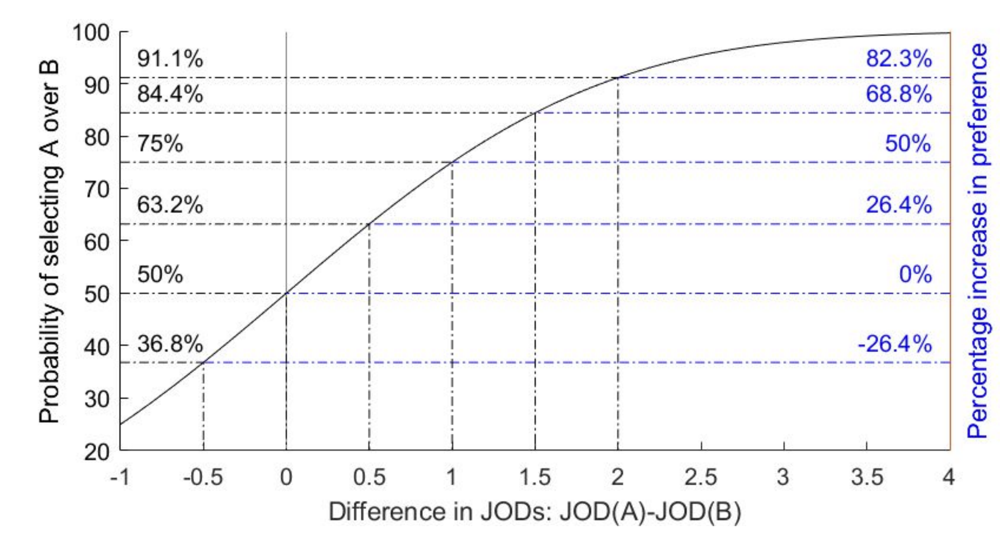

# 🎬 Workshop: Evaluación Perceptual de Video con ColorVideoVDP

**Objetivo:** Aprender a usar ColorVideoVDP para evaluar la calidad visual de video y entender las ventajas de las métricas perceptuales.

---

## 📦 Parte 0 — Instalación (hacer ANTES del workshop)

Ejecuta el instalador correspondiente a tu sistema operativo.

### Mac

```bash
bash demos/cvvdp/install/Mac/setup.sh
```

### Windows

```cmd
demos\cvvdp\install\Windows\setup.bat
```

> **Requisitos previos:** Python 3 y ffmpeg deben estar instalados en tu sistema.
> El script verifica que ambos existan (si falta alguno, te indica cómo instalarlo),
> crea un entorno virtual (`venv`), instala PyTorch y ColorVideoVDP automáticamente.
> Al finalizar ejecuta una prueba rápida para confirmar que todo funciona.

Una vez instalado, activa el entorno virtual antes de empezar:

**Mac:**
```bash
source demos/cvvdp/ColorVideoVDP/venv/bin/activate
cd demos/cvvdp/ColorVideoVDP
```

**Windows:**
```cmd
demos\cvvdp\ColorVideoVDP\venv\Scripts\activate.bat
cd demos\cvvdp\ColorVideoVDP
```

---

## 🧠 Parte 1 — Contexto (5 min)

### ¿Qué es ColorVideoVDP?

Es una métrica de calidad visual **full-reference** (necesita un video de referencia y uno distorsionado). A diferencia de PSNR, SSIM o Delta E, modela la visión humana incluyendo:

- **Sensibilidad espacial** — no todas las frecuencias se perciben igual
- **Sensibilidad temporal** — artefactos que cambian en el tiempo se notan diferente
- **Sensibilidad cromática** — canales de color (rojo-verde, violeta-amarillo) se procesan por separado
- **Modelo de display** — tiene en cuenta tamaño, resolución, brillo y distancia de visualización

### ¿Qué produce?

| Salida | Descripción |
|---|---|
| **JOD** (0–10) | Número único de calidad. 10 = idéntico. Cada 1 JOD de caída ≈ 75% de observadores notan la diferencia. |
| **Heatmap** | Video/imagen que muestra *dónde* espacialmente es visible el artefacto. |
| **Distograma** | Diagrama que descompone la distorsión por canal visual y banda de frecuencia a lo largo del tiempo. |

---

## ✅ Parte 2 — Verificación del entorno (5 min)

Comprueba que `cvvdp` funciona listando los modelos de display disponibles:

```bash
cvvdp --display '?'
```

Deberías ver una lista que incluye `standard_fhd`, `standard_4k`, `standard_hdr_pq`, entre otros.

---

## 👀 Parte 2.5 — Revisar los assets (antes de correr comandos)

Antes de ejecutar la métrica, abre la carpeta `demos/cvvdp/assets/` y **reproduce los videos** con tu reproductor favorito. Familiarízate con lo que vas a analizar:

| Archivo | Descripción |
|---|---|
| `ref.mp4` | Video **referencia** (sin distorsión) |
| `test-blur-20.mp4` | Mismo video pero con un **desenfoque circular localizado** en una zona de la imagen |
| `test-flicker-20.mp4` | Mismo video pero con un **parpadeo circular localizado** en una zona de la imagen |

> 💡 Observa cada uno y trata de notar las diferencias respecto al original.
> ¿Puedes identificar la zona afectada? ¿Cuál de los dos artefactos te parece más molesto?
> Anota tu impresión antes de ver los resultados numéricos.

---

## 🔬 Parte 3 — Ejercicio A: Comparación de calidad (10 min)

### Premisa

Imagina que estás evaluando dos clips que obtuvieron el mismo score de VMAF debido a un artefacto distinto. Tu trabajo: determinar cuál artefacto produce la **peor** experiencia visual y entender **por qué**.

### Los dos artefactos

Los videos que revisaste en el paso anterior:

1. **Desenfoque (blur)** — `test-blur-20.mp4`
2. **Parpadeo (flicker)** — `test-flicker-20.mp4`

### Ejecuta cada comparación y anota el JOD:

```bash
cvvdp --test ./assets/test-blur-20.mp4 \
      --ref ./assets/ref.mp4 \
      --display standard_fhd
```

```bash
cvvdp --test ./assets/test-flicker-20.mp4 \
      --ref ./assets/ref.mp4 \
      --display standard_fhd
```

### 📋 Completa esta tabla:

| Artefacto | JOD (tu resultado) |
|---|---|
| Desenfoque (blur) | _____ |
| Parpadeo (flicker) | _____ |

**Preguntas:**
- ¿Cuál tiene peor calidad (JOD más bajo)? Deberías ver que el **flicker** tiene un JOD notablemente más bajo (~9.41) que el **blur** (~9.77). Ambos artefactos son pequeños y localizados, pero el sistema visual humano es más sensible al parpadeo temporal.
- ¿Coincide con tu impresión visual del paso anterior?

### 🧮 Traducir JOD a preferencia humana

El JOD nos da un número de calidad, pero ¿qué significa en la práctica? Usamos la fórmula:

> **P(ref ≻ test) = Φ( ΔJOD / (σ√2) )**
>
> Donde ΔJOD = 10 − JOD_test



Esto nos dice **qué porcentaje de humanos preferiría el clip original** sobre el distorsionado.

Ejecuta el script con los JOD que obtuviste (reemplaza los valores):

```bash
python ../jod-to-human-preference.py <JOD_blur> <JOD_flicker>
```

Ejemplo: si obtuviste JOD 8.5 para blur y 7.2 para flicker:

```bash
python ../jod-to-human-preference.py 8.5 7.2
```

### 📋 Completa esta tabla con los resultados:

| Artefacto | JOD | % prefiere original |
|---|---|---|
| Desenfoque (blur) | _____ | _____ |
| Parpadeo (flicker) | _____ | _____ |

**Pregunta:** ¿A partir de qué JOD consideras que la distorsión es "aceptable" para producción?

---

## 🗺️ Parte 4 — Ejercicio B: Análisis visual con heatmaps y distogramas (10 min)

Ahora genera los outputs visuales para ambas distorsiones:

```bash
cvvdp --test ./assets/test-blur-20.mp4 \
      --ref ./assets/ref.mp4 \
      --display standard_fhd \
      --heatmap supra-threshold \
      --distogram \
      --output-dir resultados

cvvdp --test ./assets/test-flicker-20.mp4 \
      --ref ./assets/ref.mp4 \
      --display standard_fhd \
      --heatmap supra-threshold \
      --distogram \
      --output-dir resultados
```

Esto genera en la carpeta `resultados/`:
- `test-blur-20_heatmap.mp4` — heatmap del desenfoque
- `test-flicker-20_heatmap.mp4` — heatmap del parpadeo
- `test-blur-20_distogram.png` — distograma del desenfoque
- `test-flicker-20_distogram.png` — distograma del parpadeo

### 🔥 Guía: cómo leer el heatmap

El heatmap superpone una capa de color sobre el video en escala de grises. El color indica **cuánto va a notar un humano** la distorsión en esa zona:

- **Azul oscuro / negro** → El archivo tiene diferencias matemáticas respecto al original, pero la simulación del sistema visual dice que **el humano es ciego a ellas**. No las va a notar.
- **Verde / amarillo** → Distorsión moderada. Algunos observadores la notarán, otros no.
- **Rojo brillante / blanco** → **Alerta máxima.** El 100% de los usuarios va a notar un defecto evidente en esa zona.

> 💡 Lo clave: un heatmap todo azul oscuro = calidad perceptualmente perfecta, aunque el archivo tenga diferencias a nivel de píxel.

### 📊 Guía: cómo leer el distograma

El distograma descompone la distorsión en **canales del sistema visual humano** (columnas) y **bandas de frecuencia espacial** (eje Y), a lo largo del tiempo (eje X):

**Columnas — canales visuales:**
| Canal | ¿Qué detecta? |
|---|---|
| `A-sust` | Acromático sostenido — patrones estáticos de luminancia (detalle, textura, bordes) |
| `A-trans` | Acromático transitorio — cambios temporales (parpadeo, titileo) |
| `RG` | Cromático rojo-verde |
| `YV` | Cromático violeta-amarillo |

**Eje Y — frecuencia espacial:**
| Banda | Significado |
|---|---|
| `BB` (base, abajo) | Frecuencias bajas — cambios graduales, uniformidad general |
| Bandas intermedias | Frecuencias medias — texturas, patrones |
| Bandas altas (arriba) | Frecuencias altas — bordes finos, detalle nítido |

**Color de cada celda:** más amarillo/brillante = más distorsión visible en ese canal y frecuencia.

> 💡 El distograma te dice **por qué** algo se ve mal: si la energía está en `A-trans` es un problema temporal (flicker); si está en las bandas altas de `A-sust` es pérdida de nitidez (blur); si está en `RG`/`YV` es un problema cromático.

---

### 📋 Preguntas para analizar:

**Heatmaps:**
1. ¿Se ve claramente la zona circular afectada en cada heatmap? En ambos casos deberías ver un parche circular bien definido — el resto de la imagen está en azul oscuro (sin distorsión perceptible).
2. ¿Qué colores ves en el parche de cada heatmap? El flicker debería mostrar colores más cálidos (más visible) que el blur.

**Distogramas:**
1. En el distograma del **blur**: ¿en qué canal está la energía? Deberías ver bandas horizontales estables en `A-sust` (acromático sostenido) y algo en `RG`/`YV` en frecuencias bajas. El canal `A-trans` debería estar **completamente oscuro** — el blur no cambia entre frames.
2. En el distograma del **flicker**: ¿qué canal se enciende? Deberías ver una banda continua y brillante en `A-trans` (acromático transitorio) en frecuencias bajas-medias. Además, `A-sust` muestra un patrón de **tablero de ajedrez** — se enciende y apaga rítmicamente porque el parpadeo alterna entre el frame original y el alterado.
3. ¿Por qué el flicker tiene peor JOD que el blur? Mirá los distogramas: el flicker activa `A-trans`, un canal donde somos **muy sensibles** a cualquier cambio. El blur solo afecta `A-sust` en bandas altas, donde el enmascaramiento y la CSF reducen la sensibilidad.

> **Conclusión clave:** El distograma te permite diagnosticar la *naturaleza* del artefacto. Si la energía está en `A-trans` → problema temporal. Si está en `A-sust` bandas altas → pérdida de nitidez. Si está en `RG`/`YV` → problema cromático.

---

## 🖥️ Parte 5 — Bonus: Cambiar el display (5 min)

Repite el análisis pero usando un display 4K en vez de Full HD:

```bash
cvvdp --test ./assets/test-blur-20.mp4 ./assets/test-flicker-20.mp4 \
      --ref ./assets/ref.mp4 \
      --display standard_4k \
      --heatmap supra-threshold \
      --distogram \
      --output-dir resultados_4k
```

### 📋 Completa esta tabla:

| Artefacto | JOD en FHD | JOD en 4K | ¿Subió o bajó? |
|---|---|---|---|
| Desenfoque (blur) | _____ | _____ | _____ |
| Parpadeo (flicker) | _____ | _____ | _____ |

### 📋 Preguntas:

1. El JOD del **blur debería bajar** (empeorar) en 4K (~9.77 → ~9.60). ¿Por qué? Porque un display 4K tiene más píxeles por grado (75.4 ppd vs 37.8 ppd) → puede resolver frecuencias espaciales más altas → la *ausencia* de detalle que eliminó el blur se vuelve más evidente.
2. El JOD del **flicker debería mantenerse prácticamente igual** (~9.41 → ~9.41). ¿Por qué? Porque el parpadeo es un artefacto **puramente temporal** — la frecuencia temporal no cambia con la resolución del display. Los ppd no afectan al canal `A-trans`.
3. Conectá esto con los distogramas: el blur vive en `A-sust` (canal espacial, sensible a ppd) y el flicker vive en `A-trans` (canal temporal, independiente de ppd). **Los distogramas ya te anticipaban qué artefacto iba a cambiar con el display.**

---


### Referencia rápida de comandos

```bash
# Solo JOD
cvvdp --test <test> --ref <ref> --display standard_fhd

# JOD + heatmap + distograma
cvvdp --test <test> --ref <ref> --display standard_fhd \
      --heatmap supra-threshold --distogram

# Guardar resultados en CSV
cvvdp --test <test> --ref <ref> --display standard_fhd --result resultados.csv

# JOD → preferencia humana
python ../jod-to-human-preference.py <jod_1> <jod_2> ...

# Ver opciones de heatmap: threshold (cerca del umbral), supra-threshold (diferencias grandes), raw
# Ver displays disponibles: cvvdp --display '?'
```
